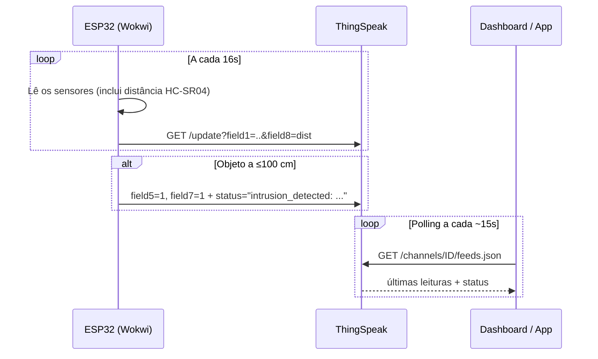

# Sistema IoT — Automação para Datacenter

Sistema embarcado baseado em **ESP32-WROOM** para automação e monitoramento de um datacenter. Mede temperatura, umidade, luminosidade, tensão AC e distância, comuta automaticamente a fonte de energia (**solar ↔ diesel**) conforme a luminosidade, detecta presença/invasão via sensor **ultrassônico HC-SR04** com alarme sonoro, monitora a **tensão AC** do quadro elétrico e transmite tudo para a nuvem via **ThingSpeak**, consumido por um dashboard web e um app mobile.

> 🌐 **Dashboard online:** https://datacenter-iot-dashboard.vercel.app · **App mobile:** Android (Expo, atualizável via OTA).

> **Modo de operação:** o projeto roda em **simulação online no [Wokwi](https://wokwi.com)** (sem necessidade de montar o hardware), enviando os dados por **HTTP** para um canal do **ThingSpeak**. O esquemático e o guia de montagem física continuam disponíveis para quem quiser reproduzir o protótipo real.

## Estrutura do projeto

```
BETA IOT 2.0/
├── firmware/datacenter_iot/   # Sketch Arduino + Wokwi
├── dashboard/                 # Dashboard web (HTML + CSS + JS)
├── mobile/                    # App mobile (Expo / React Native)
├── docs/                      # Guia de montagem, BOM, esquemático, Wokwi
└── README.md
```

## Grandezas monitoradas

| # | Grandeza | Sensor | Pino | Campo ThingSpeak |
|---|---|---|---|---|
| 1 | Temperatura | DHT22 | GPIO 2 | field1 |
| 2 | Umidade | DHT22 (mesmo sensor) | GPIO 2 | field2 |
| 3 | Luz solar | LDR + 10kΩ | GPIO 34 (ADC1) | field3 |
| 4 | Tensão AC (simulada) | Potenciômetro | GPIO 35 (ADC1) | field4 |
| 5 | Presença/Movimento | HC-SR04 (ultrassônico) | TRIG 27 / ECHO 14 | field5 (0/1) |
| 6 | Distância | HC-SR04 (mesmo sensor) | TRIG 27 / ECHO 14 | field8 (cm) |

Campos auxiliares: `field6` = fonte de energia (1=solar, 0=diesel), `field7` = alarme (0/1). O `field5` é **1** quando há objeto a **≤100 cm**; o `field8` traz a **distância em cm**. O campo **status** carrega a descrição da invasão.

> ℹ️ A tensão AC é **simulada** por um potenciômetro no Wokwi (não há ZMPT101B real). O `field8`, que antes era uptime, agora carrega a distância do HC-SR04.

Veja [docs/esquematico.md](docs/esquematico.md) para o mapa de pinagem completo.

## Setup — passo a passo

### 1. ThingSpeak (nuvem)

1. Crie uma conta gratuita em [thingspeak.com](https://thingspeak.com).
2. **Channels → New Channel** e habilite os **8 campos** (`field1`..`field8`) conforme a tabela acima (o `field8` é a **distância**).
3. Salve. Na aba **API Keys**, anote:
   - **Write API Key** → usada pelo firmware.
   - **Channel ID** + **Read API Key** → usados pelo dashboard e pelo app.
4. Em **Channel Settings**, marque *Make Public* para que dashboard/app leiam **sem** a Read API Key (é assim que o projeto está configurado — canal `3399683`, público).

> ⚠️ Conta gratuita aceita **1 envio a cada 15s** por canal. O firmware usa intervalo de **16s** (`SEND_INTERVAL`).

### 2. Firmware (ESP32 no Wokwi)

1. Abra [firmware/datacenter_iot/](firmware/datacenter_iot/).
2. No topo de [sketch.ino](firmware/datacenter_iot/sketch.ino), ajuste as credenciais (já preenchidas para a simulação):
   - `WIFI_SSID` = `"Wokwi-GUEST"`, `WIFI_PASSWORD` = `""` (rede do Wokwi)
   - `THINGSPEAK_WRITE_API_KEY` = sua Write API Key
3. Bibliotecas necessárias (Library Manager): `DHT sensor library` (Adafruit) + `Adafruit Unified Sensor`.
4. Rode no Wokwi (▶) e acompanhe o Serial Monitor — ou rode **localmente via Wokwi CLI** (há `wokwi.toml` na pasta). Detalhes em [docs/wokwi.md](docs/wokwi.md).

> Para hardware real, use o Arduino IDE com a placa **ESP32 Dev Module** e o SSID/senha da sua rede no lugar do `Wokwi-GUEST`.

### 3. Dashboard web

1. A config fica em [dashboard/thingspeak-config.js](dashboard/thingspeak-config.js) (versionada, só `channelId` — o canal é público). Para um canal privado, crie `thingspeak-config.local.js` (gitignored) sobrescrevendo com a `readApiKey`.
2. Abra [dashboard/index.html](dashboard/index.html) no navegador, ou sirva a pasta `dashboard/` em qualquer host estático. **Já publicado no Vercel:** https://datacenter-iot-dashboard.vercel.app (deploy automático via `vercel.json` → `outputDirectory: dashboard`).

### 4. App mobile (Expo)

1. Em [mobile/](mobile/), copie `.env.example` → `.env` e preencha `EXPO_PUBLIC_THINGSPEAK_CHANNEL_ID` (e `EXPO_PUBLIC_THINGSPEAK_READ_API_KEY` se o canal for privado).
2. `npm install` e `npx expo start` para desenvolvimento.
3. **APK:** `eas build -p android --profile preview`. **Atualizações OTA** (só JS, sem rebuild): `eas update --channel preview` (ou `production`). O canal do ThingSpeak é injetado no build pelo `eas.json`.

## Fluxo de dados



## Lógica de automação

- **Comutação solar/diesel**: `lightLevel > 50%` → painel solar ativo; senão, gerador diesel. Pequeno delay entre desligar uma fonte e ligar a outra (segurança).
- **Alarme anti-invasão**: objeto detectado pelo HC-SR04 a **≤100 cm** → buzzer por 10s + LED piscando + `field5=1`, `field7=1` e descrição no `status`. Se houver nova detecção durante o alarme, o contador de 10s reinicia.
- **Tensão AC (simulada)**: lida de um potenciômetro no GPIO35 e mapeada para 0–250 V (`analogRead/4095*250`). Não há ZMPT101B real nesta simulação.

## Considerações sobre o ThingSpeak

- **Sem tempo real / sem login**: o ThingSpeak é série-temporal e *append-only*. O dashboard e o app fazem **polling** (~15s) da Read API; não há autenticação de usuário nem push via WebSocket.
- **Eventos de invasão**: são reconstruídos a partir do campo `status` do feed (preenchido pelo firmware só quando há evento). O botão **Reconhecer** é **local** (localStorage no web, AsyncStorage no app) — o ThingSpeak não persiste o estado de reconhecimento.

## Avisos de segurança

- ⚠ **Alta tensão (hardware real)**: se for usar um ZMPT101B de verdade, a conexão do lado AC (110/220V) deve ser feita por um eletricista qualificado. Na simulação a tensão vem de um potenciômetro (sem risco).
- A **Write API Key** está embutida no [sketch.ino](firmware/datacenter_iot/sketch.ino) para a simulação. Se vazar, gere uma nova na aba *API Keys* do ThingSpeak. A Read API Key não é necessária (canal público).
- Os relés do projeto **simulam** a lógica de comutação; em um datacenter real, use um **ATS (Automatic Transfer Switch)** industrial e use o ESP32 apenas para sinalização.

## Documentação adicional

- [Guia de simulação no Wokwi + ThingSpeak](docs/wokwi.md)
- [Guia de montagem passo a passo](docs/montagem.md)
- [Lista de materiais](docs/bom.md)
- [Esquemático e mapa de pinagem](docs/esquematico.md)
