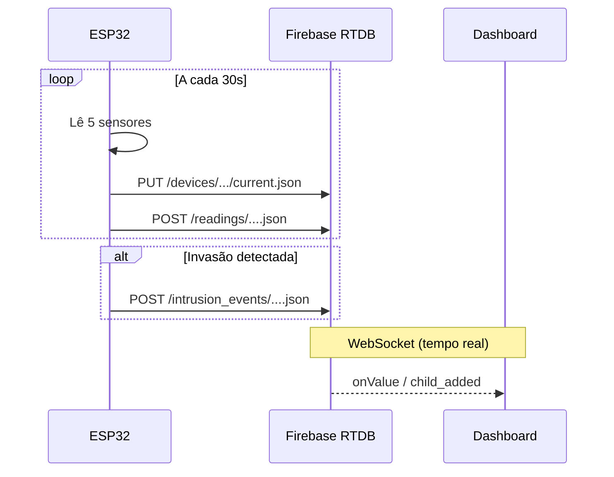

# Sistema IoT — Automação para Datacenter

Sistema embarcado baseado em **ESP32-WROOM** para automação e monitoramento de um datacenter. Mede **5 grandezas físicas**, comuta automaticamente a fonte de energia (**solar ↔ diesel**) conforme a luminosidade, detecta invasão via sensor **PIR** com alarme sonoro, monitora a **tensão AC** do quadro elétrico e transmite tudo em tempo real para um **Firebase Realtime Database** consumido por um dashboard web.

## Estrutura do projeto

```
BETA IOT 2.0/
├── firmware/datacenter_iot/   # Sketch Arduino + Wokwi
├── firebase/                  # Regras e estrutura do RTDB
├── dashboard/                 # Dashboard web (HTML + CSS + JS)
├── docs/                      # Guia de montagem, BOM, esquemático, Wokwi
└── README.md
```

## Grandezas monitoradas

| # | Grandeza | Sensor | Pino |
|---|---|---|---|
| 1 | Temperatura | DHT22 | GPIO 4 |
| 2 | Umidade | DHT22 (mesmo sensor) | GPIO 4 |
| 3 | Luz solar | LDR + 10kΩ | GPIO 34 (ADC1) |
| 4 | Movimento | HC-SR501 (PIR) | GPIO 27 |
| 5 | Tensão AC | ZMPT101B | GPIO 35 (ADC1) |

Veja [docs/esquematico.md](docs/esquematico.md) para o mapa de pinagem completo.

## Setup — passo a passo

### 1. Firebase Realtime Database

1. Acesse [console.firebase.google.com](https://console.firebase.google.com) e clique em **"Adicionar projeto"**.
2. Nome do projeto: `datacenter-iot` (ou o que preferir). Google Analytics pode ficar desativado.
3. No menu lateral: **Build → Realtime Database → Criar banco de dados**.
4. Região: **us-central1** (ou a mais próxima). Modo: **"Iniciar no modo de teste"**.
5. Copie a URL do banco (algo como `https://SEU_PROJETO-default-rtdb.firebaseio.com`).
6. Na aba **"Regras"**, cole o conteúdo de [firebase/database_rules.json](firebase/database_rules.json) e publique.
7. Em **Configurações do projeto → Contas de serviço → Database secrets**, clique em **"Mostrar"** e copie o **Database Secret** (chave longa).

### 2. Firmware (ESP32)

1. Instale o **Arduino IDE** e adicione o board manager do ESP32:
   - Em *Arquivo → Preferências*, adicione a URL:
     ```
     https://raw.githubusercontent.com/espressif/arduino-esp32/gh-pages/package_esp32_index.json
     ```
   - Em *Ferramentas → Gerenciador de Placas*, procure por "ESP32" e instale "ESP32 by Espressif Systems".
2. Selecione a placa: **ESP32 Dev Module**, Upload Speed **921600**, Flash Size **4MB**, Partition Scheme **Default 4MB with spiffs**.
3. Instale as bibliotecas (*Sketch → Incluir Biblioteca → Gerenciar Bibliotecas*):
   - `DHT sensor library` (Adafruit)
   - `Adafruit Unified Sensor`
   - `ArduinoJson` (≥ 6.0)
4. Abra [firmware/datacenter_iot/datacenter_iot.ino](firmware/datacenter_iot/datacenter_iot.ino).
5. Edite [firmware/datacenter_iot/config.h](firmware/datacenter_iot/config.h) com:
   - `WIFI_SSID` / `WIFI_PASSWORD` da sua rede
   - `FIREBASE_HOST` (URL do RTDB **sem `https://`** e **sem barra final**)
   - `FIREBASE_AUTH` (Database Secret copiado no passo 1.7)
6. Conecte o ESP32 via USB, selecione a porta serial e faça o **upload**.
7. Abra o **Serial Monitor** em **115200 baud**.

### 3. Dashboard web

1. Edite [dashboard/app.js](dashboard/app.js) e ajuste `firebaseConfig.databaseURL` com a URL do seu RTDB.
2. Abra [dashboard/index.html](dashboard/index.html) diretamente no navegador (funciona localmente) **ou** hospede no Firebase Hosting:

   ```bash
   npm install -g firebase-tools
   firebase login
   firebase init hosting       # escolher pasta "dashboard" como public
   firebase deploy --only hosting
   ```

## Fluxo de dados



## Lógica de automação

- **Comutação solar/diesel**: `lightLevel > 40%` → painel solar ativo; senão, gerador diesel. Delay de 3s entre desligar uma fonte e ligar a outra (segurança).
- **Alarme anti-invasão**: PIR em HIGH → buzzer por 10s + LED piscando + evento registrado no Firebase. Se houver novo movimento durante o alarme, o contador de 10s reinicia.
- **Tensão AC**: leitura RMS com 1000 amostras a ~10kHz, subtrai offset DC e aplica fator de calibração (0.489 padrão; ajuste se necessário com multímetro em paralelo).

## Simulação online

Veja [docs/wokwi.md](docs/wokwi.md) — o projeto inclui `diagram.json` e `wokwi.toml` para rodar no [Wokwi](https://wokwi.com) com sensores equivalentes (PIR → pushbutton, ZMPT101B → potenciômetro).

## Avisos de segurança

- ⚠ **Alta tensão (ZMPT101B)**: a conexão do lado AC (110/220V) deve ser feita por um eletricista qualificado. Para testes didáticos, use uma extensão cortada com terminais fixos.
- Em produção, **nunca** deixe as regras do Firebase em "modo de teste" — migre para Firebase Auth e regras baseadas em UID.
- Os relés do projeto **simulam** a lógica de comutação; em um datacenter real, use um **ATS (Automatic Transfer Switch)** industrial e use o ESP32 apenas para sinalização.

## Documentação adicional

- [Guia de montagem passo a passo](docs/montagem.md)
- [Lista de materiais](docs/bom.md)
- [Esquemático e mapa de pinagem](docs/esquematico.md)
- [Guia de simulação no Wokwi](docs/wokwi.md)
