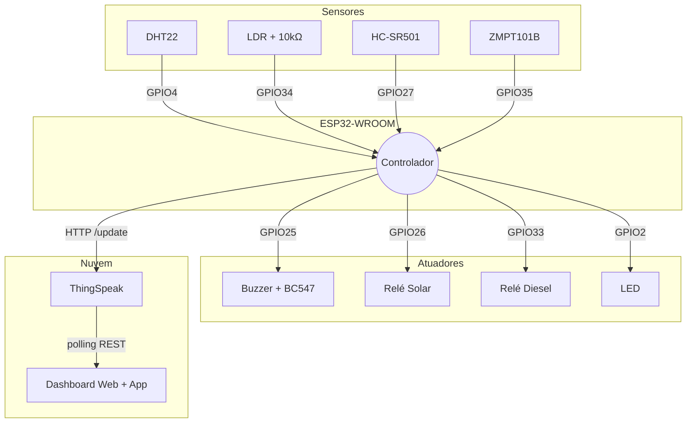

# Esquemático e Pinagem — ESP32-WROOM

## Mapa de pinos

```
+-----------------------------------------------+
|              ESP32-WROOM DevKit V1            |
|                                               |
|   =========== ENTRADAS (SENSORES) ===========|
|   GPIO 4         <- DHT22 (Temp + Umidade)   |
|   GPIO 34 (ADC1) <- LDR (Luz Solar)          |
|   GPIO 27        <- HC-SR501 (PIR)           |
|   GPIO 35 (ADC1) <- ZMPT101B (Tensão AC)     |
|                                               |
|   =========== SAÍDAS (ATUADORES) ============|
|   GPIO 25        -> Buzzer (via BC547)        |
|   GPIO 26        -> Relé 1 (Solar)           |
|   GPIO 33        -> Relé 2 (Diesel)          |
|   GPIO 2         -> LED onboard (Status)     |
|                                               |
|   =========== ALIMENTAÇÃO ====================|
|   3.3V           -> DHT22, LDR               |
|   5V (VIN)       -> HC-SR501, ZMPT101B, Relés|
|   GND            -> Terra comum              |
+-----------------------------------------------+
```

> **IMPORTANTE**: o ADC2 do ESP32 NÃO funciona com Wi-Fi ativo.
> Só use **ADC1** para sinais analógicos: GPIOs 32, 33, 34, 35, 36, 39.

## Diagrama de blocos



## Circuito detalhado

### DHT22
```
 3.3V ──┬── VCC (DHT22)
        │
      [10kΩ]  (pull-up)
        │
 GPIO4 ─┴── DATA (DHT22)
 GND ────── GND (DHT22)
```

### LDR (divisor de tensão)
```
 3.3V ── [LDR] ──┬── GPIO34 (ADC1)
                  │
                [10kΩ]
                  │
                 GND
```

### Buzzer via BC547
```
 GPIO25 ── [1kΩ] ── Base (BC547)
                       │
                   Coletor ── Buzzer(-) ── 5V
                       │
                   Emissor ── GND
                          (Buzzer(+) em 5V direto)
```

### Relés
```
 GPIO26 ── IN (Relé 1, Solar)
 GPIO33 ── IN (Relé 2, Diesel)
 VCC ── 5V | GND ── GND
 Lado AC: COM / NO conforme instalação
```

### ZMPT101B
```
 Lado DC: VCC=5V, GND=GND, OUT=GPIO35
 Lado AC: 2 terminais em PARALELO com fase/neutro (110/220V)
 ⚠ PERIGO — instalação por eletricista qualificado
```
