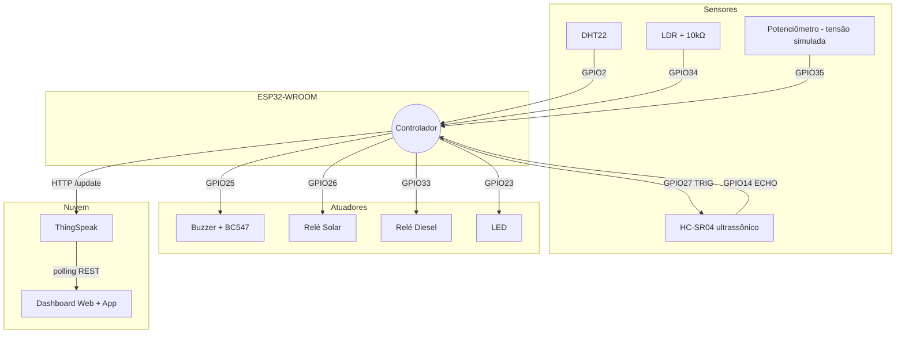

# Esquemático e Pinagem — ESP32-WROOM

## Mapa de pinos

```
+-----------------------------------------------+
|              ESP32-WROOM DevKit V1            |
|                                               |
|   =========== ENTRADAS (SENSORES) ===========|
|   GPIO 2         <- DHT22 (Temp + Umidade)   |
|   GPIO 34 (ADC1) <- LDR (Luz Solar)          |
|   GPIO 27        -> HC-SR04 TRIG             |
|   GPIO 14        <- HC-SR04 ECHO            |
|   GPIO 35 (ADC1) <- Potenciômetro (Tensão*) |
|                                               |
|   =========== SAÍDAS (ATUADORES) ============|
|   GPIO 25        -> Buzzer                    |
|   GPIO 26        -> Relé 1 (Solar)           |
|   GPIO 33        -> Relé 2 (Diesel)          |
|   GPIO 23        -> LED (Status)             |
|                                               |
|   =========== ALIMENTAÇÃO ====================|
|   3.3V           -> DHT22, LDR               |
|   5V (VIN)       -> HC-SR04                  |
|   GND            -> Terra comum              |
+-----------------------------------------------+

(*) Tensão AC é SIMULADA por um potenciômetro no Wokwi (não há ZMPT101B).
```

> **IMPORTANTE**: o ADC2 do ESP32 NÃO funciona com Wi-Fi ativo.
> Só use **ADC1** para sinais analógicos: GPIOs 32, 33, 34, 35, 36, 39.

## Diagrama de blocos



## Circuito detalhado

### DHT22
```
 3.3V ──┬── VCC (DHT22)
        │
      [10kΩ]  (pull-up)
        │
 GPIO2 ─┴── DATA (DHT22)
 GND ────── GND (DHT22)
```

### LDR (divisor de tensão)
```
 3.3V ── [LDR] ──┬── GPIO34 (ADC1)
                  │
                [10kΩ]
                  │
                 GND
```

### Buzzer via BC547
```
 GPIO25 ── [1kΩ] ── Base (BC547)
                       │
                   Coletor ── Buzzer(-) ── 5V
                       │
                   Emissor ── GND
                          (Buzzer(+) em 5V direto)
```

### Relés
```
 GPIO26 ── IN (Relé 1, Solar)
 GPIO33 ── IN (Relé 2, Diesel)
 VCC ── 5V | GND ── GND
 Lado AC: COM / NO conforme instalação
```

### HC-SR04 (ultrassônico — presença/distância)
```
 VCC  ── 5V
 GND  ── GND
 TRIG ── GPIO27   (saída: pulso de disparo)
 ECHO ── GPIO14   (entrada: largura do eco → distância)
```
Distância = `pulseIn(ECHO) * 0.0343 / 2` (cm). Objeto a **≤100 cm** → `field5=1` (presença) e dispara o alarme. A distância vai no `field8`.

### Tensão AC (simulada por potenciômetro)
```
 3.3V ── terminal 1 do potenciômetro
 GND  ── terminal 2
 GPIO35 (ADC1) ── cursor (wiper)
```
O firmware mapeia a leitura para 0–250 V (`analogRead/4095*250`). **Não há ZMPT101B** nesta simulação — para hardware real, substitua por um ZMPT101B (lado AC em paralelo com fase/neutro, instalação por eletricista qualificado).
